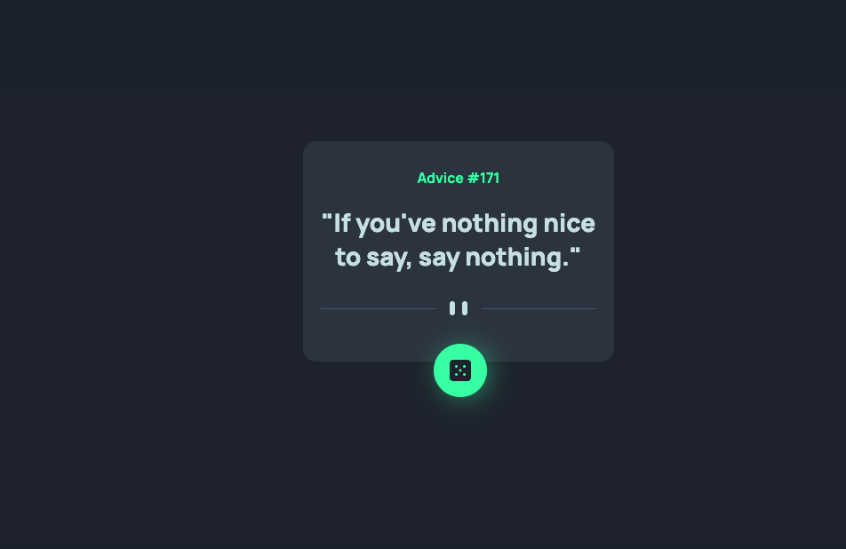
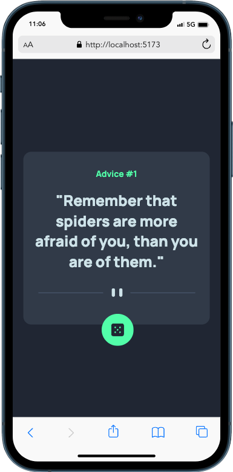

# Frontend Mentor - Advice generator app solution

This is a solution to the [Advice generator app challenge on Frontend Mentor](https://www.frontendmentor.io/challenges/advice-generator-app-QdUG-13db).

- [Frontend Mentor - Advice generator app solution](#frontend-mentor---advice-generator-app-solution)
    - [The challenge](#the-challenge)
    - [Screenshot](#screenshot)
    - [Links](#links)
  - [My process](#my-process)
    - [Built with](#built-with)
    - [What I learned](#what-i-learned)
  - [Author](#author)

### The challenge

Users should be able to:

- View the optimal layout for the app depending on their device's screen size
- See hover states for all interactive elements on the page
- Generate a new piece of advice by clicking the dice icon

### Screenshot

### Links

- Live Site URL: [Advice-Generator](https://statuesque-unicorn-a4d264.netlify.app/)

## My process

### Built with

- Semantic HTML5 markup
- SCSS
- [React](https://reactjs.org/) - JS library

### What I learned

Small recap of react/vite, scss and media queries

## Author

- Frontend Mentor - [@kleeblattdev](https://www.frontendmentor.io/profile/kleeblattdev)
